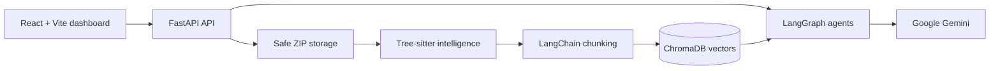

# CodePilot AI

CodePilot AI is an enterprise repository-intelligence platform. Upload a source repository to map its structure, index it for semantic retrieval, explore engineering health metrics, and ask grounded questions through Gemini-powered specialist agents.


## What it does

- Safely accepts and validates ZIP repositories.
- Uses Tree-sitter to index Java, Python, JavaScript, and TypeScript.
- Builds repository maps, dependency relationships, language statistics, and architecture signals.
- Chunks and indexes source in ChromaDB with local sentence-transformer embeddings.
- Uses RAG-grounded Gemini responses for code explanation, review, security, documentation, onboarding, and multi-agent workflows.
- Presents repository scores, charts, dependencies, insights, and timeline data in a React dashboard.

## Architecture



Read the detailed [architecture guide](docs/ARCHITECTURE.md).

## Quick start with Docker

1. Copy `apps/api/.env.example` to `apps/api/.env`.
2. Set `GEMINI_API_KEY` in `apps/api/.env` to enable Gemini features.
3. Start the stack:

   ```bash
   docker compose up --build
   ```

4. Open the app at `http://localhost:8080` and API docs at `http://localhost:8000/docs`.

See the complete [installation guide](docs/INSTALLATION.md) and [deployment guide](docs/DEPLOYMENT.md).

## Local development

Backend (Python 3.12+):

```bash
cd apps/api
python -m venv .venv
# Windows: .venv\Scripts\activate
pip install -r requirements-dev.txt
copy .env.example .env
uvicorn app.main:app --reload
```

Frontend (Node 20+):

```bash
cd apps/web
npm install
copy .env.example .env
npm run dev
```

## Testing and quality

```bash
cd apps/api && pytest tests
cd apps/web && npm run build
```

GitHub Actions runs backend tests, frontend production builds, and both Docker image builds for pushes and pull requests.

## Documentation

- [API reference](docs/API.md)
- [Architecture](docs/ARCHITECTURE.md)
- [Installation](docs/INSTALLATION.md)
- [Deployment](docs/DEPLOYMENT.md)
- [Screenshot placeholders](docs/SCREENSHOTS.md)

## Security notes

Never commit `.env` files or Gemini credentials. The repository uploader rejects unsafe archive paths and symbolic links, enforces configurable archive limits, and stores data locally by default. Dashboard scores are structural heuristics, not security certification or a penetration test.

## License

Add a license before publishing the repository.
