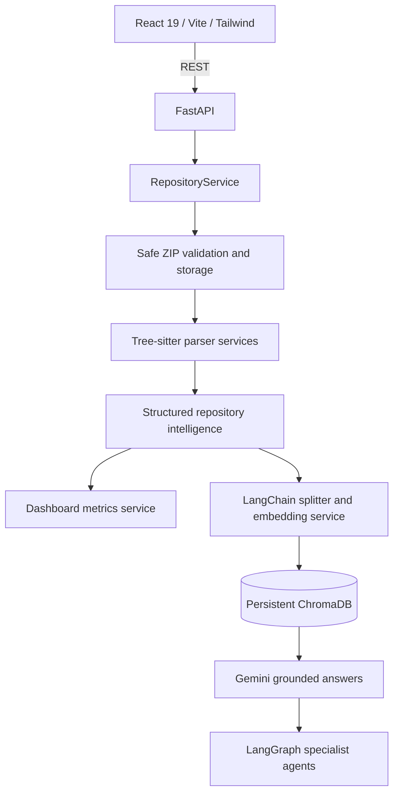

# Architecture

The API persists repositories under `REPOSITORY_STORAGE_DIR` and vector data under `CHROMA_STORAGE_DIR`. The intelligence model is the boundary between parsing and retrieval, so embeddings and LLM behavior can evolve without changing parser output.
